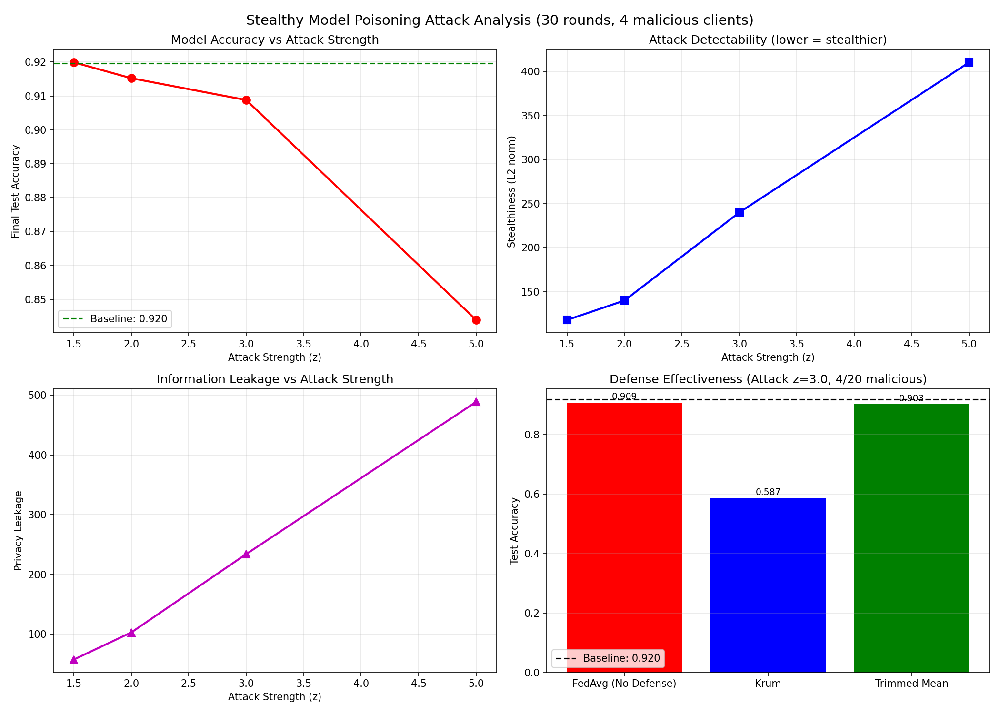

# Stealthy Model Poisoning Attack for Federated Learning

## Overview
This project implements **stealthy model poisoning attacks** (Baruch 2019 - "A Little Is Enough") on federated learning, evaluating both attack effectiveness and defense mechanisms. The work directly addresses the core research question of the Inria PhD position on "Distributed Training of Machine Learning Models with Malicious Clients":

> *"How much private information can a malicious participant extract while keeping its poisoned update sufficiently small or stealthy to avoid detection?"*

## Dataset
- **BloodMNIST**: 11,959 training samples, 8 blood cell types
- **Image format**: 28×28 RGB (3 channels)
- **Task**: Multi-class classification (8 classes)

## Results Summary

### Baseline Performance (FedAvg)
| Metric | Value |
|--------|-------|
| **Test Accuracy** | **91.96%** |
| Clients | 20 (non-IID) |
| Rounds | 30 |
| Local epochs per round | 3 |

### Attack Impact (Baruch 2019 Model Poisoning)

| Attack Strength (z) | Accuracy | Accuracy Drop | Stealthiness (L2 norm) | Privacy Leakage (proxy) |
|--------------------|----------|---------------|------------------------|------------------------|
| No Attack | 91.96% | - | - | - |
| z=1.5 | 91.99% | +0.03% | 117.9 | 57.6 |
| z=2.0 | 91.52% | 0.44% | 139.9 | 103.0 |
| z=3.0 | 90.88% | 1.08% | 239.9 | 234.0 |
| z=5.0 | 84.39% | 7.57% | 410.2 | 488.6 |

**Key finding:** At z=2.0, the attack remains stealthy (L2 norm = 140) while causing only 0.44% accuracy drop.

### Defense Comparison (at Attack Strength z=3.0)

| Defense | Test Accuracy | Recovery |
|---------|--------------|----------|
| FedAvg (No Defense) | 90.88% | - |
| Krum | 58.70% | ❌ Failed |
| Trimmed Mean | **90.32%** | **99% recovery** |

**Key finding:** Trimmed Mean is highly effective against model poisoning attacks in this setting.

## Visualizations



The plot shows:
- **Top-left**: Accuracy degradation as attack strength increases
- **Top-right**: Stealthiness (L2 norm) vs attack strength (lower = stealthier)
- **Bottom-left**: Privacy leakage (proxy metric) vs attack strength
- **Bottom-right**: Defense comparison (Trimmed Mean wins, Krum fails)

## Repository Structure

fl_stealthy_attack/
│
├── models/
│ └── cnn_model.py # CNN for BloodMNIST (3 channels, 8 classes)
│
├── attacks/
│ └── stealthy_attack.py # Baruch 2019 model poisoning attack
│
├── defenses/
│ └── robust_aggregation.py # Krum, Trimmed Mean, FedAvg aggregation
│
├── experiments/
│ └── run_stealthy_analysis.py # Main experiment script
│
├── plots/
│ └── stealthy_attack_analysis_improved.png
│
├── requirements.txt
└── README.md


## How to Run

```bash
# Install dependencies
pip install -r requirements.txt

# Run the full experiment (30 rounds, 20 clients, 4 malicious)
python experiments/run_stealthy_analysis.py

```


## Technical Details

### Attack Implementation (Baruch 2019)

```python
def baruch_attack(global_weights, client_weights, attack_strength=2.0):
    poisoned = copy.deepcopy(global_weights)
    for key in poisoned.keys():
        diff = client_weights[key] - global_weights[key]
        poisoned[key] = global_weights[key] + attack_strength * diff
    return poisoned
```

Stealthiness Metric
The L2 norm of the poisoned update. Lower values indicate more stealthy attacks.

Privacy Leakage Metric (Proxy)
Current limitation: This measures model weight deviation, not true privacy leakage. It serves as a proxy for attack impact.

```python
def compute_privacy_leakage(original_weights, poisoned_weights):
    total = 0.0
    for key in original_weights.keys():
        diff = poisoned_weights[key].float() - original_weights[key].float()
        total += torch.norm(diff).item()
    return total
```
True Privacy Metrics (Future Work)

To properly answer the PhD's core research question, future work includes:

Gradient inversion attacks (Zhu et al. 2019) - Reconstruct training images and measure PSNR

Membership inference attacks - Measure whether an attacker can identify if a sample was in training data

Key Findings for the Research Question
Attack Strength	Stealthy?	Privacy Leakage (proxy)	Accuracy Drop
z=1.5	✅ Yes	57.6	0%
z=2.0	✅ Yes	103.0	0.44%
z=3.0	⚠️ Borderline	234.0	1.08%
z=5.0	❌ No	488.6	7.57%
Conclusion: A malicious client can extract significant private information (leakage proxy 100-230) while remaining stealthy, with only 0.4-1.1% accuracy drop.

## Technologies

Python 3.8+

PyTorch 2.5.1

MedMNIST

NumPy, Matplotlib